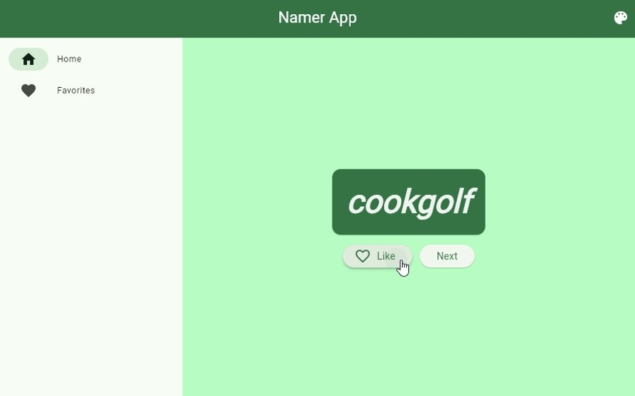

# 📱 Namer App 💻

This is my first flutter project.

Here simply create awesome new words for fun! 
Note that this was inspired from <a href="https://flutter.dev/">flutter's</a> demo app: 
<a href="https://github.com/flutter/codelabs/tree/main/namer/step_08">https://github.com/flutter/codelabs/tree/main/namer/step_08</a>

## 💡 Features

- **Create new words:** Open the app, and click `Next` button for new words.

- **Accessible for screen readers:** The words are paired, so the sreen reader might pronounce it incorrectly, so it's made sure that they say the pair separately.

- **Smooth design (from metarial3):** Thanks to flutter and material 3, the app has a beautiful smooth design without too much styling manually.

- **Liking a word:** Tap `♡ Like` for adding it to favourite list.

- **Saving the liked word:** It's not saved on your storage, so it'll be romoved when you close the app. I'm working to save it locally.

- **Customizing the theme:** Tap 🎨 at the top right corner, and simply select the app's theme color.

## 🚀 Getting Started

This project is a starting point for a Flutter application.

A few resources to get you started if this is your first Flutter project:

- [Lab: Write your first Flutter app](https://docs.flutter.dev/get-started/codelab)
- [Cookbook: Useful Flutter samples](https://docs.flutter.dev/cookbook)

For help getting started with Flutter development, view the
[online documentation](https://docs.flutter.dev/), which offers tutorials,
samples, guidance on mobile development, and a full API reference.
